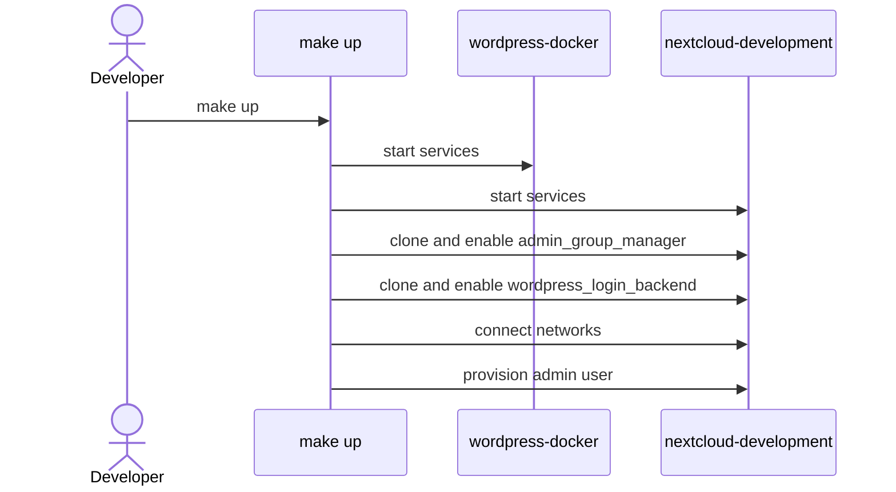
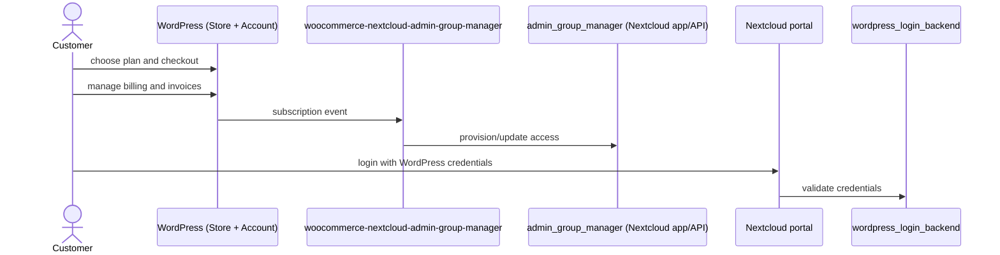

# LibreSign

Document management and signature solution with full control over your data.

## LibreSisn SaaS

Orchestrates LibreSign provisioning with WordPress as client-facing layer for SaaS deployment.

## Quick Start

```bash
make up
make down
make help  # View all available commands
```

## Integration Flow

WordPress is the customer-facing commerce and account portal (plans, subscriptions, invoices, payments, and account reports).

### Component Roles

- [`Makefile`](./Makefile): orchestrates local development environment (start services, connect networks, setup and enable required Nextcloud apps).
- [`wordpress-docker`](https://github.com/LibreCodeCoop/wordpress-docker): storefront and customer account portal (checkout, subscriptions, invoices, billing).
- [`woocommerce-nextcloud-admin-group-manager`](https://github.com/LibreSign/woocommerce-nextcloud-admin-group-manager) (WordPress plugin): converts subscription/account events into integration calls.
- [`nextcloud-development`](https://github.com/LibreCodeCoop/nextcloud-docker-development): local Nextcloud runtime where integration apps are installed/enabled.
- [`admin_group_manager`](https://github.com/LibreSign/admin_group_manager) (Nextcloud app/API): receives integration calls and applies provisioning/access updates.
- [`wordpress_login_backend`](https://github.com/LibreSign/wordpress_login_backend) (Nextcloud app): allows authentication in Nextcloud using WordPress credentials.

### Developer Flow



### Customer Flow


