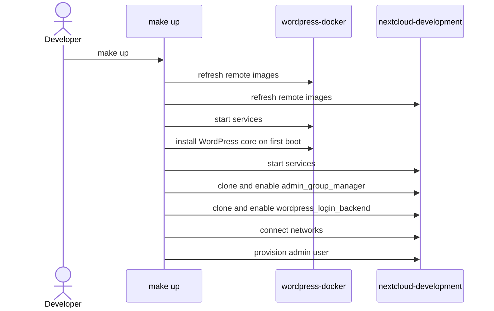
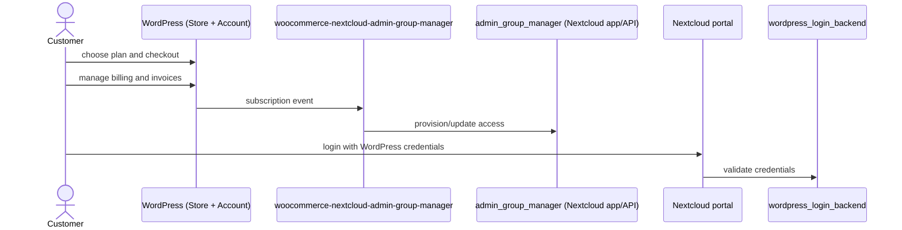

# LibreSign

Document management and signature solution with full control over your data.

## LibreSign SaaS

Orchestrates LibreSign provisioning with WordPress as client-facing layer for SaaS deployment.

## Quick Start

The Nextcloud and WordPress environments are git submodules. Initialize them
before the first `make up`:

```bash
git submodule update --init
```

Then start the stack:

```bash
make up
make down
make help  # View all available commands
```

`make up` refreshes the remote Docker images used by the WordPress and Nextcloud
services and rebuilds local buildable services before starting the stack, so
changes pulled in the submodules are picked up without separate manual pull or
build steps.

On a fresh WordPress database, `make up` also performs the initial WordPress
installation via WP-CLI and restarts the WordPress container once so the
`wordpress-docker` entrypoint can install the configured plugins and themes.

## Integration Flow

WordPress is the customer-facing commerce and account portal (plans, subscriptions, invoices, payments, and account reports).

### Component Roles

- [`Makefile`](./Makefile): orchestrates local development environment (refresh images, start services, perform first WordPress install when needed, connect networks, setup and enable required Nextcloud apps).
- [`wordpress-docker`](https://github.com/LibreCodeCoop/wordpress-docker): storefront and customer account portal (checkout, subscriptions, invoices, billing).
- [`woocommerce-nextcloud-admin-group-manager`](https://github.com/LibreSign/woocommerce-nextcloud-admin-group-manager) (WordPress plugin): converts subscription/account events into integration calls.
- [`nextcloud-development`](https://github.com/LibreCodeCoop/nextcloud-docker-development): local Nextcloud runtime where integration apps are installed/enabled.
- [`admin_group_manager`](https://github.com/LibreSign/admin_group_manager) (Nextcloud app/API): receives integration calls and applies provisioning/access updates.
- [`wordpress_login_backend`](https://github.com/LibreSign/wordpress_login_backend) (Nextcloud app): allows authentication in Nextcloud using WordPress credentials.

### Developer Flow



### Customer Flow


